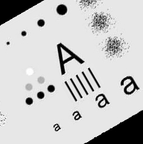
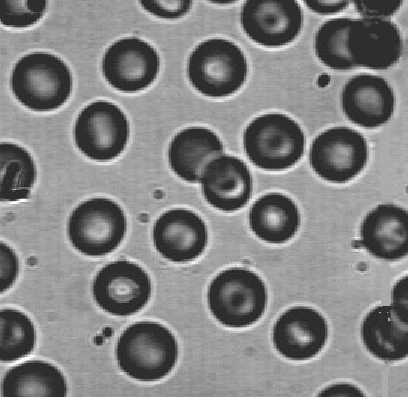
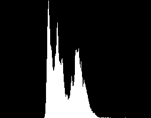
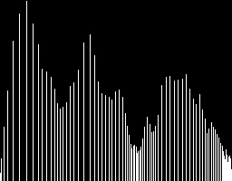
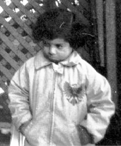
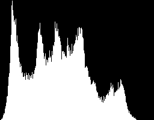
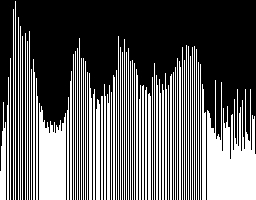

# 2025秋CS1003.21计算机程序设计大作业实验报告

## C语言数字图像处理

**PB25111633 胡运晨**

### 0. 准备工作

#### 0.1 主结构

1. 读入图像（已提供），保存至```unsigned char* image```
2. 声明输出图像用的指针```unsigned char* output```并**申请内存**
3. 输出提示词，并读入操作类型
4. ```switch```至不同task的主函数
5. 写出函数图像（已提供）
6. **释放内存**

代码如下：

```c
#define _CRT_SECURE_NO_WARNINGS
#include <stdio.h>
#include <math.h>
#include <stdlib.h>
#define PI 3.14159265358979323846
#define STB_IMAGE_IMPLEMENTATION
#define STB_IMAGE_WRITE_IMPLEMENTATION
#include "D:\USTC\Program\ImageProcessing\stb_image.h"
#include "D:\USTC\Program\ImageProcessing\stb_image_write.h"
#include "task.h"
int main()
{
	int width, height, channels;
	unsigned char* image = stbi_load("D:\\USTC\\Program\\ImageProcessing\\ImageProcessing\\TestData\\alphabet1.jpg", &width, &height, &channels, 1);//读入图像用的函数
	unsigned char* output = (unsigned char*)malloc(width * height * channels);
	int ctrl;
	printf("要进行何种操作？\n1-图像的平移旋转和放缩\n2-图像的直方图均衡化\n3-图像的空间域滤波去噪\n4-彩色图像的K-means算法有损压缩\n5-图像的频率域滤波\n6-图像的四叉树分裂合并算法\n");
	scanf("%d", &ctrl);
	switch (ctrl) {
	case 1:
		task1(image, output, width, height, channels);
		break;
	}
	stbi_write_jpg("D:\\USTC\\Program\\ImageProcessing\\ImageProcessing\\TestData\\task1.jpg", width, height, 1, output, 100);//写出函数的图像
	stbi_image_free(image);
	free(output);//释放内存的函数
	return 0;
}
```

#### 0.2 基本函数

1. 坐标转换函数：将输入的行数、列数转换为一维数组中的坐标（坐标=行数*宽度+列数），返回坐标

  ```c
  int trans(int row, int column, int width) {
  	return row * width + column;
  }
  ```

2. 中位数计算函数：输入数组`arr[]`和数字个数`n`，随后先对输入的数据用冒泡排序，再返回`arr[(n-1)/2]`

```c
int median(int arr[], int n) {
	for (int i = 0; i < n - 1; i++) {
		for (int j = 0; j < n - i - 1; j++) {
			if (arr[j] > arr[j + 1]) {
				int temp = arr[j];
				arr[j] = arr[j + 1];
				arr[j + 1] = temp;
			}
		}
	}
	return arr[(n - 1) / 2];
}
```


### 1. Task1 图像的平移旋转和放缩

#### 1.1 数据准备

1. 输入的角度为角度制，需要转换为弧度制，实现代码为`angle = angle * PI / 180.0`，其中`PI`为圆周率，已在头文件中定义

2. 行数和列数的计算：使用`i`控制计算循环，则行数`row = i / width`，列数`column = i % width`

3. 注意到，若进行放缩操作，输出图像的宽高会发生变化，因此利用以下代码计算其宽高

	```c
	newWidth = (int)(width * scale);
	newHeight = (int)(height * scale);
	```

4. 在确定`newWidth,newHeight`大小后再申请相应的内存

#### 1.2 旋转算法

```c
originrow = cos(angle) * (row - centrerow) + sin(angle) * (column - centrecolumn) + centrerow;
origincolumn = -sin(angle) * (row - centrerow) + cos(angle) * (column - centrecolumn) + centrecolumn;
```

1. 平移：将现有的行列坐标转换为以输入的中心为原点的坐标（减掉中心点的坐标）

2. 旋转：参考已提供的矩阵旋转公式进行反向旋转，得到在原图像中对应的坐标

#### 1.3 放缩算法

```c
originrow = row / scale;
origincolumn = column / scale;//放缩
```

直接将行列数除以放缩的倍数即可得到对应原图像中的像素点行列数

#### 1.4 最近邻插值法

```c
nearestNeighbor(image, output, i, round(originrow) * width + round(origincolumn), width, height);
void nearestNeighbor(unsigned char* image, unsigned char* output, int i, int origini, int width, int height) {
	if (origini >= width * height || origini < 0) {
		output[i] = 0;//边界处理
	}
	else {
		output[i] = image[origini];
	}
}//最近邻插值法
```

1. 最近邻：借助`<math.h>`中的`round`函数实现四舍五入，找到最近的点
2. 边界处理：在原图像坐标之外的点（`origini >= width * height || origini < 0`）直接赋0

#### 1.5 双线性插值法

```c
void bilinearNeighbor(unsigned char* image, unsigned char* output, int row, int column, double originrow, double origincolumn, int width, int height) {
	if (trans(originrow, origincolumn, width) >= width * height || trans(originrow, origincolumn, width) < 0) {
		output[trans(row, column, width)] = 0;//边界处理
	}
	else {
		int f_a = image[trans((int)originrow, (int)origincolumn, width)];
		int f_b = image[trans((int)originrow, (int)origincolumn + 1, width)];
		int f_c = image[trans((int)originrow + 1, (int)origincolumn, width)];
		int f_d = image[trans((int)originrow + 1, (int)origincolumn + 1, width)];
		double f_e = (originrow - (int)originrow) * (f_c - f_a) + f_c;
		double f_f = (originrow - (int)originrow) * (f_d - f_b) + f_b;
		double f_xy = (origincolumn - (int)origincolumn) * (f_f - f_e) + f_e;
		if (f_xy > 255) {
			f_xy = 255;
		}
		else if(f_xy < 0) {
			f_xy = 0;
		}
		output[trans(row, column, width)] = f_xy;
	}
}//双线性插值法
```

1. 该算法直接翻译自大作业文档，不再赘述
2. 边界处理：同1.3.2
3. 插值数据`f_xy`溢出：小于0的数据直接赋0，大于255的数据直接赋255

#### 1.6 图像展示

使用最临近插值法绕点(100,100)旋转30度：


使用双线性插值法绕点(100,100)旋转30度：



使用最临近插值法将图片`blood.jpg`放大1.5倍：



使用双线性插值法将图片`blood.jpg`放大1.5倍：


#### 1.7 插值法视觉效果差异

从两组图像看，相较于最临近插值法，双线性插值法生成的图片边缘锯齿更少，边缘过渡更自然

### 2. Task2 图像的直方图均衡化

直方图绘制函数在文档中已给出，在此不再赘述，需要注意的是，该函数传入的为灰度值计数而非频率

#### 2.1 灰度值计算

```c
void generateHist(unsigned char* image, int* hist, int width, int height) {
	for (int row = 0; row < height; row++) {
		for (int column = 0; column < width; column++) {
			hist[image[trans(row, column, width)]]++;
		}
	}
	
}//计算灰度值
```

依次扫描所有像素点，对`hist`中的灰度值计数+1即可

#### 2.2 图像均衡化

```c
void equalization(unsigned char* image, unsigned char* output, int* originHist, int width, int height) {
	double temp[256] = { 0 };
	temp[0] = originHist[0];
	for (int i = 1; i < 256; i++) {
		temp[i] = temp[i - 1] + originHist[i];
	}
	for(int i=0; i < 256; i++) {
		temp[i] /= (width * height);
	}
	for (int row = 0; row < height; row++) {
		for (int column = 0; column < width; column++) {
			output[trans(row, column, width)] = (int)((L - 1) * temp[image[trans(row, column, width)]] + 0.5);
		}
	}
}//图像均衡化
```

1. `temp`用于存储累计频率，先计算累计次数（类似阶乘计算），再除以像素总数得到频率
2. 依据文档中给出的均衡化公式计算新的灰度值，其中`L`的值已在头文件中定义

#### 2.3 图像展示

1. `pout.jpg`均衡化前后的直方图对比
    	

2. `pout.jpg`均衡化前后视觉效果对比
	

3. `lena.jpg`均衡化前后的直方图对比

		

4. `lena.jpg`均衡化前后视觉效果对比

		

发现均衡化后灰度值分布更加均匀，但保持原有形状基本不变（约等于将直方图拉伸），且均衡化后图像更明亮，明暗对比更明显

### 3. Task3 图像的空间域滤波去噪

#### 3.1 阈值设置

不设置阈值时，等同于阈值为0，因此直接赋初值0，之后的处理过程是否设阈值均一致

#### 3.2 均值滤波

```c
int averageFilter(unsigned char* image, int row, int column, int width, int height, int filterSize) {
	int sum = 0;
	row -= (filterSize - 1) / 2;
	column -= (filterSize - 1) / 2;
	for (int i = 0; i < filterSize; i++) {
		for (int j = 0; j < filterSize; j++) {
			if (row + i < 0 || row + i >= height || column + j < 0 || column + j >= width) {
				sum += 0;
			}
			else {
				sum += image[trans(row + i, column + j, width)];
			}
		}
	}
	return sum / (filterSize * filterSize);
}//均值滤波函数
```

1. 输入行列数之后需要进行平移操作，将累加起点设置为邻域的左上角
2. 依次遍历邻域内所有像素点，若超出图像范围则置为0
3. 返回均值

#### 3.3 中值滤波

```c
int medianFilter(unsigned char* image, int row, int column, int width, int height, int filterSize) {
	row -= (filterSize - 1) / 2;
	column -= (filterSize - 1) / 2;
	int* temp = (int*)malloc(filterSize * filterSize * sizeof(int));
	int cnt = 0;
	for (int i = 0; i < filterSize; i++) {
		for (int j = 0; j < filterSize; j++) {
			if (row + i < 0 || row + i >= height || column + j < 0 || column + j >= width) {
				temp[cnt++] = 0;
			}
			else {
				temp[cnt++] = image[trans(row, column, width)];
			}
		}
	}
	return median(temp, filterSize * filterSize);
}//中值滤波函数
```

1. 平移和遍历操作与均值滤波相同
2. 将遍历到的像素点存入`temp[]`中，最后用`median`函数计算中位数并返回

#### 3.4 滤波效果及对比

**为方便横向对比，邻域大小统一设置为`3X3`，阈值大小统一设置为`20`**
